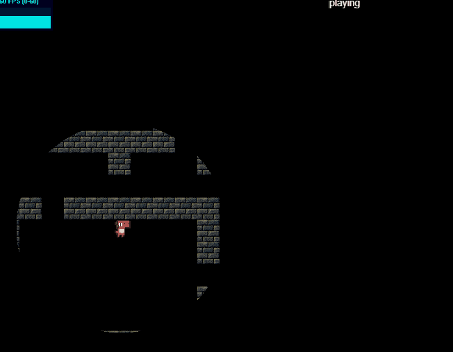

# Multiplayer Hide and Seek 
This is a small, multiplayer game I built to learn more about 
[client side state synchronization](https://gafferongames.com/post/state_synchronization/), [client/server input reconciliation](https://gabrielgambetta.com/client-side-prediction-server-reconciliation.html),
and the [ECS design pattern](https://en.wikipedia.org/wiki/Entity_component_system).



## Development

```bash
# After cloning, install in the root
yarn install

# Start the server
cd server/
yarn run dev

# Start the client (in a new terminal)
cd client/
yarn run dev
```

You can open multiple browser windows, connecting to `https://localhost:3000` to spawn different players.

| Key          | Action         |
|--------------|----------------|
| Num Pad 2    | Start the game |
| WASD         | Movement       |
| Space (held) | Sneak          |

### Subprojects
The project is setup as a yarn mono-repo. There are three sub-projects:

* `server/` - Contains a node.js application that runs the authoritative game simulation
* `client/` - Contains a ReactJS application wrapping the [ecsy](https://github.com/MozillaReality/ecsy)/[pixi.js](https://www.pixijs.com/) game.
* `shared/` - Contains game code that are shared between both

## Client/Server State Synchronization
For this game, I wanted to explore how to have a quick response time on the on
the client. As a result, I choose *not* to make a 'thin' client (eg client 
captures inputs, server runs the game, client just renders state updates).

Instead, the game has multiple simulations running in parallel:

* **Server Simulation** - The authoritative game. This is considered the source of
  truth and is the only simulation capable of making decisions of consequence
  (eg, a player was tagged / game over / etc). All user input is sent from
  the clients to the server where it is run. The server sends periodic state
  updates to the client.

* **Client Simulations** - Each client runs their own local simulation. This
  simulation shares much of the same physics and collision code as the server.
  Its goal is to accept user input, send it to the server, and optimistically
  apply it locally. This gives the user the perception of immediate feedback.
  In effect, the client simulations are tryng to predict the likely outcome of the
  game while they wait for the next state packet from the server. Its possible
  that they may be wrong and they will need to reconcile these differences. The 
  clients are not allowed to make any decisions of consequence. For example,
  they may show that your character can not walk through a wall, but they could
  not mark a character as caught.

At the moment, the server state update packets are very simple and send the entire
state of the game entities (velocity, mass, position, etc). This should be
switched to only sending deltas.

## Reconciling User Input
With the client optimistically applying inputs there are some interesting timing
problems. For example, lets assume that there is high lag, and it takes `500ms`
for a packet to be sent between the client and server. If the client sends a user
input, it will takes `1s` before the results of this input are sent back to the
client. However, over that `1s` period, the client would have still been receiving
a stream of periodic state updates that predate the input. Blinding updating the clients
state to match these would result in the the optimistic application of user input
being lost.

To handle this, I follow a pattern based off on an [article by Abriel Gambetter](https://gabrielgambetta.com/client-side-prediction-server-reconciliation.html).

* Each input sent from the client is given an input ID
* Clients apply the input optimistically
* The client keeps a queue of inputs that have not yet been confirmed by the server
* Server update messages are updated to include the ID of the last user input that has
  been processed by the server
* Upon recieving a state update, the client snaps the world objects to the new positions.
  It will then replay all user inputs in the unconfirmed queue.

In this game, since user input affects each simulation step (eg move 5px/s 
while left is pressed), a simulation step for the player is re-run for each unconfirmed
action. In psuedo-code, this looks something like:

```typescript
for (const unconfirmed of unconfirmedInputs) {
  playerControlSystem.updatePlayer(unconfirmed);
  const entitiesToUpdate = playerControlSystem.getLocalControlledEntities();
  physicsSystem.updateEntities(delta, time, entitiesToUpdate);
  collisionSystem.execute(delta);
}
```

## Entity / Component / System
This is [game architectural pattern](https://en.wikipedia.org/wiki/Entity_component_system) 
that I had not tried before and wanted to apply. In the pattern, your game entities are
decomposed into buckets of data, called `Components`. For example, you may have a component
for `Position` that contains an `x/y`, or you might have a component for `Life` that contains
a `health`. You can freely combine these components on your entities.  `Systems` then operate
on all entities that have a certain combination of these components. For example, a 
`PhysicsSystem` might update the `Position` component on all entities.

The entities themselves now have little data. All logic has been decomposed into `Systems`
and all game data into `Components`, with the entity itself just being an ID to lookup
its relevant components. 

I see a few of positives with this pattern:

* It gives a good deal of flexibiity in combining components for different behavior
  without needing to create a bunch of sub-classes
* It nicely decouples the game logic
* `Components` of the same type can be kept in contiguous memory. Since Systems 
  iterate over certain at components a time, this gives us a performance boost due to
  [data locality](https://gameprogrammingpatterns.com/data-locality.html).

For this project, I used an experimental Javascript library called [ecsy](https://github.com/MozillaReality/ecsy).